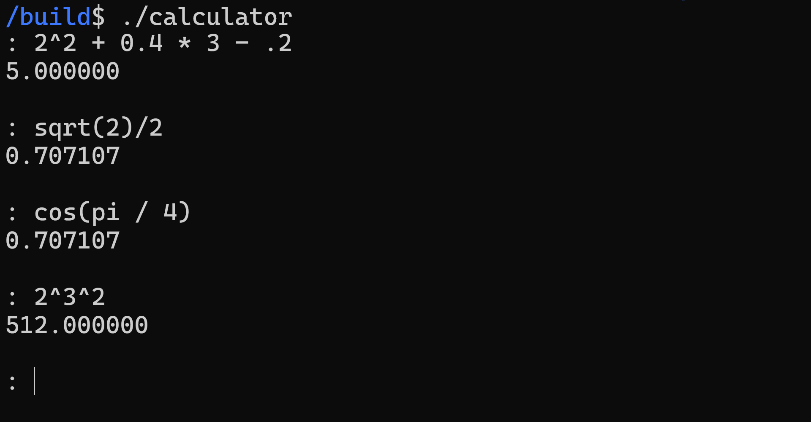

# Terminal based calculator



## Instructions
: \<expression\> \<ENTER\>

'q' to quit.

## Build Instructions
```
mkdir build
cd build
cmake ..
make
```
# Supported Syntax
## Constants
* `pi`
* `e`
## Functions
| Function | Example |
| --- | --- |
| `floor` | floor(2.72) -> 2 |
| `ceil` | ceil(3.14) -> 4 |
| `sin` | sin(2pi) -> 1 |
| `cos` | cos(2pi) -> 0 |
| `tan` | tan(pi/4) -> 1 |
| `asin` | asin(1) -> 1.5708 |
| `acos` | acos(1) -> 0 |
| `atan` | atan(1) -> 0.785398 |
| `sqrt` | sqrt(9) -> 3 |
| `log` | log(10^3) -> 3 |
| `ln` | ln(e) -> 1 |
| `log_<base>` | log_2(16) -> 4 |
## Custom Variables
Custom variables can be made with the following format:

\<variable_name\> = \<value\>

Note: Variable names cannot include numbers or special characters, only letters
